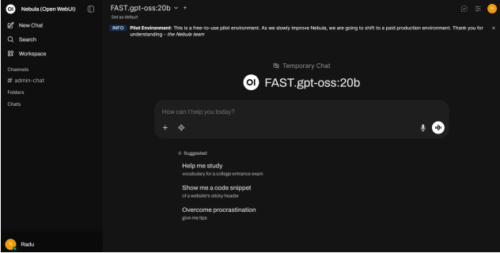

<!-- We can put a brief introduction to Nebula platform in this section -->

## Getting to Know the Platform

Nebula’s interface is similar to other popular large language model platforms, so if you use
other AI platforms you may find it familiar

The text box in the middle of the screen can be used to chat with the models. These chats are **not saved**, and they will **disappear** as soon as you create a new conversation, refresh,or leave the page. To learn how to save chats, please check the [Saving Chats]().

WARNING: ALWAYS verify information generated by LLMs!

Using the “+” button on the lower left side of the prompt text box, you can add files,
photos, public web pages, and [Knowledge Bases]() to the prompt.

Different models can be selected using the dropdown at the top left of the screen. This
dropdown contains a combination of both original models, and user-created models. The
original models can be distinguished from the user-created models by the naming
convention <optional_tag>.<model_name>:<number_of_parameters>b (e.g., gemma3:12b
or FAST.gpt-oss:20b) identifying the original models.

In the interest of privacy, conversations with large language models are not saved in
Nebula. This also means that your conversation is going to disappear as soon as you
create a new conversation, refresh, or leave the page.

## Changing Password

1. Click on your **profile picture**, either on the bottom left or top right corner of your
screen.
2. Click on **Settings**.
3. Click on **Account**.
4. Click on **Show**, to the right side of the **Change Password**.
5. Change your password.

## Saving Chats

1. Click on the  button at the top right on your screen. 
2. Click on .
3. Choose your preferred file format for the download.

## Setting a Default System Prompt
Unlike most other AI platforms, Nebula does not have a default **System Prompt**. You can set a default system prompt by:
1. Click on your **profile picture**, either on the bottom left or top right corner of your
screen.
2. Click on **Settings**.
3. Click on **General**.
4. Type your text in the **System Prompt** text box.
5. Click on **Save**.

## Knowledge Bases

Knowledge bases allow you to add files that the models can reference when giving you an
answer, thus decreasing the chances of the model hallucinating. In more technical terms,
using a knowledge base with a model creates a form of Retrieval Augmented Generation
(RAG).
See [here]() for the official documentation.

WARNING: Knowledge bases are saved on the server! DO NOT upload sensitive
information to the Knowledge Bases!

If you need to use knowledge bases with sensitive information for your project, please
contact us (nebula.cs@vu.nl) and we can discuss options.

### Creating knowledge bases

1. Navigate to **Workspace**, then click on **Knowledge**. You should see all the
Knowledge Bases that are public on Nebula with the tag.
2. Click on the button on the top right of the screen.
3. Follow the instructions on the screen for creating the Knowledge Base
4. Click the  button  at the top right of your screen and choose what to upload:

   a. allows you to upload individual files.

   b. allows you to upload an entire folder.

   c. allows you to synchronize a folder created via the Folders option.

   d. allows you to add a public web page.

   e. allows you to type text yourself.

5. Try out the knowledge base by prompting a large language model and adding your
knowledge base by clicking on the plus button on the bottom of the prompt box.

**NOTE: Currently Nebula only supports simple file formats such as .txt, .md, and .pdf.
Tables in PDF files cannot be read. We are working on a solution, thank you for
understanding.**

### Editing knowledge bases

1. Navigate to the knowledge tab (Workspace -> Knowledge)
2. Click on the knowledge base you want to edit. You can only edit knowledge bases that do not have the   tag.

### Deleting knowledge bases

1. Navigate to the knowledge tab (Workspace -> Knowledge).
2. Click on the three horizontal dots next to your knowledge base. You can only delete knowledge bases that do not have the   tag.
3. Click on **Delete**.

     a. All files in the knowledge base are going to be removed from the server as soon as you delete the knowledge base, and within 7 days from all backups.

## Models 

The Models tab allows you to create your own custom models by setting system prompts, attaching knowledge bases by default (no more need to click on the + button when prompting), or adjusting the advanced parameters. By attaching a knowledge base, you are creating a RAG system. See [here]() for the official documentation.

### Creating Models

1. Navigate to **Workspace**, then click on **Models**. You should see all the models created by other users that are public on Nebula.
2. Click on the  button on the top right of the screen.
3. Follow the instructions on the screen for creating the Model.

     a. We recommend setting a System Prompt. Example: “You are a helpful assistant”

    b. Please have a look at the [Advanced Parameters](), and [Modifying Advanced Parameters]() sections if you want to edit the advanced parameters section
4. Click on **Save & Create**.

### Editing Models

1. Navigate to the models tab (Workspace -> Models).
2. On the model you want to edit, click on the  , then  . You can only edit models that do not have the  tag.
3. Edit your model.
4. Click on **Save & Update**.

### Deleting Models

1. Navigate to the models tab (Workspace -> Models).
2. Click on the three horizontal dots next to your knowledge base. You can only delete models that do not have the   tag.
3. Click on **Delete**.

## Prompts

Prompts allow you to save prompts that you use often and add variables inside of these
prompts.
See [here]() for the official documentation.

